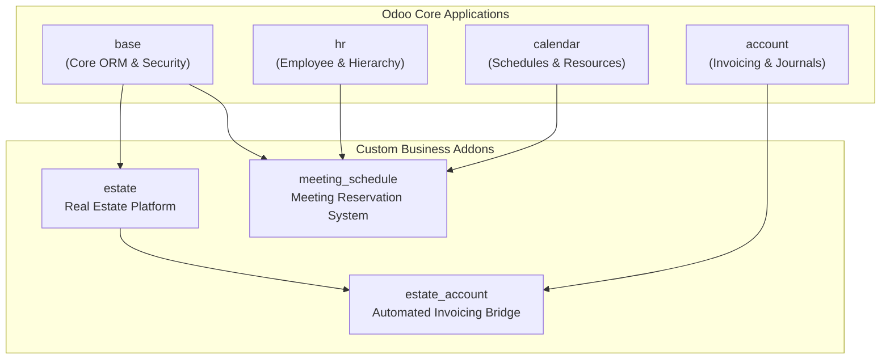

```markdown
# Odoo 15 Enterprise Addons & Solutions Suite

[](https://www.odoo.com)
[](https://www.python.org/)
[](https://www.postgresql.org/)
[](https://www.docker.com/)
[](https://github.com/Alia4a/tutorials/actions)
[](https://www.gnu.org/licenses/lgpl-3.0)
[](#localization)

A modular, enterprise-ready suite of custom Odoo 15 business applications, integrations, and architectural solutions developed and maintained by [Alia4a](https://github.com/Alia4a).

---

## 📑 Table of Contents
- [Architecture & Dependencies](#architecture--dependencies)
- [Featured Modules](#featured-modules)
  - [1. Meeting Reservation System (`meeting_schedule`)](#1-meeting-reservation-system-meeting_schedule)
  - [2. Real Estate Management (`estate`)](#2-real-estate-management-estate)
  - [3. Estate Accounting Bridge (`estate_account`)](#3-estate-accounting-bridge-estate_account)
- [Security & Access Control](#security--access-control)
- [Continuous Integration & Quality Assurance](#continuous-integration--quality-assurance)
- [Quickstart & Deployment](#quickstart--deployment)
  - [Docker Compose Deployment](#docker-compose-deployment)
  - [Native / CLI Execution](#native--cli-execution)
- [Repository Structure](#repository-structure)
- [Contributing & License](#contributing--license)

---

## 🏗 Architecture & Dependencies

The modules build incrementally upon Odoo 15 core frameworks:



---

## 🚀 Featured Modules

### 1. Meeting Reservation System (`meeting_schedule`)
> **Dependencies**: `base`, `hr`, `calendar` | **Application**: True

A facility management module for scheduling meeting rooms, preventing double bookings, managing operating hours, and enforcing role-based confirmations.

- **🏢 Building Hierarchy & Working Hours**:
  - Buildings configured with operating schedules in UTC (`working_time_start`, `working_time_end`).
  - Integration with `resource.calendar` for enterprise shift patterns, holidays, and work intervals.
  - Automatic computed room counts (`room_ids`).
- **🚪 Meeting Room Capacities**:
  - Room code unique per building.
  - Seating capacity validation preventing overbooking.
- **📅 Smart Reservation Engine**:
  - **No-Overlap Validation**: Automated collision detection prevents double-booking confirmed meetings in the same room.
  - **Working Hours Check**: Enforces that reservations fall strictly within the building's operating hours and active schedule.
  - **Auto-Calculated Durations**: Dynamically computes meeting length from start/end timestamps.
- **👥 Role-Based Approval Workflow**:
  - **Draft**: Initial reservation created by any employee.
  - **Confirmed**: Requires HR Manager authorization (`hr.group_hr_manager`).
  - **Canceled**: Allowed by the original organizer or HR Managers.
- **📊 Interactive Visual Views**:
  - Kanban board grouped by room with quick Confirm/Cancel action buttons and capacity badges.
  - <span id="localization"></span>
  - Decorated list views (Red = Canceled, Green = Confirmed, Blue = Draft).
- **🌐 Localization**: Full English and Arabic (`i18n/ar.po`, `i18n/ar_001.po`) translations.

---

### 2. Real Estate Management (`estate`)
> **Dependencies**: `base` | **Application**: True

A real-estate listing and offer negotiation platform adhering strictly to Odoo 15 development standards.

- **🏡 Property Management**:
  - Availability scheduling (default 3 months), expected vs. selling price tracking.
  - Computed total area (`living_area + garden_area`) and best offer computation (`_compute_best_price`).
  - Garden orientation selections and facade specifications.
- **🤝 Offer Negotiation Engine**:
  - Auto-calculated deadline dates based on offer validity.
  - Strict price guardrail: Offers lower than 90% of expected price trigger validation exceptions.
  - Accepting an offer auto-sets the property buyer and selling price, refusing remaining offers.
- **🏷️ Categorization & Tags**:
  - Property types with sequence ordering and custom tags with color widgets.

---

### 3. Estate Accounting Bridge (`estate_account`)
> **Dependencies**: `estate`, `account`

Seamlessly bridges real-estate sales with standard Odoo customer invoicing (`account.move`).

- Overrides property `action_sold()`:
  - Generates a customer invoice (`move_type: out_invoice`) for the property buyer.
  - Automatically appends invoice lines:
    1. **6% Agency Commission** based on the final property selling price.
    2. **Administrative Fee** ($100 flat fee).

---

## 🔒 Security & Access Control

Each custom module implements access control lists (`ir.model.access.csv`) and record rules (`ir.rule`):

| Model | Group | Permissions | Multi-Company Isolation |
|---|---|---|---|
| `meeting.building` | All Users / HR Managers | Read / Full CRUD | Yes (`meeting_building_rule_company`) |
| `meeting.room` | All Users / HR Managers | Read / Full CRUD | Yes (`meeting_room_rule_company`) |
| `meeting.reservation` | All Users | Create, Read, Cancel Own | Yes (`meeting_reservation_rule_company`) |
| `meeting.reservation` | HR Manager (`hr.group_hr_manager`) | Full CRUD, Confirm, Cancel All | Yes (`meeting_reservation_rule_company`) |
| `estate.property` | All Users | Full CRUD | Base access |

---

## 🧪 Continuous Integration & Quality Assurance

Automated testing is configured via **GitHub Actions** ([`.github/workflows/github-actions.yml`](.github/workflows/github-actions.yml)):

```bash
# 1. Compile and syntax-check all custom Python models
python -m compileall estate estate_account meeting_schedule

# 2. Validate XML view structure and security data integrity
xmllint --noout estate/views/*.xml estate_account/views/*.xml meeting_schedule/views/*.xml meeting_schedule/security/*.xml
```

---

## ⚡ Quickstart & Deployment

### Docker Compose Deployment
The project includes a multi-container Docker environment:

```bash
# Clone the repository
git clone -b 16.0 git@github.com:Alia4a/tutorials.git custom_addons
cd odoo-docker

# Launch Odoo 15 & PostgreSQL 13
docker-compose up -d
```

- **Odoo URL**: `http://localhost:8069`
- **PostgreSQL**: Port `5433` (internal `5432`)
- **Addons Mount**: `custom_addons` mounted into `/mnt/addons`

### Native / CLI Execution
```bash
# Run with local Odoo 15 instance
python3 odoo-bin -d odoo15 \
  --addons-path="/path/to/odoo/addons,./custom_addons" \
  -i meeting_schedule,estate,estate_account
```

---

## 📁 Repository Structure

```text
custom_addons/
├── .github/workflows/
│   └── github-actions.yml                 # Automated syntax & XML validation CI
├── meeting_schedule/                      # Meeting Room Reservation Application
│   ├── models/                            # Building, Room, Reservation & ResUsers ORM models
│   ├── views/                             # Kanban, Tree, Form views & Top menus
│   ├── security/                          # Access CSV & Multi-Company ir.rules
│   ├── i18n/                              # Arabic translations (ar.po, ar_001.po, pot)
│   └── static/description/icon.png        # Module icon
├── estate/                                # Real Estate Management Application
│   ├── models/                            # Property, Type, Tag, Offer models
│   ├── views/                             # Property views, menus, user inheritance
│   └── security/                          # Access CSV
├── estate_account/                        # Accounting Invoicing Integration
│   └── models/estate_property.py          # Auto-invoice generation on sale
├── website_airproof/                      # Custom responsive theme & carousel solution
├── awesome_tshirt/                        # OWL / Web framework solution
├── awesome_gallery/                       # Custom gallery view solution
├── owl_playground/                        # OWL playground sandbox
├── ODOO_15_FINAL_WORD_AND_RUNBOT_GUIDE.md # Developer guide for Odoo 15 standards
└── README.md                              # Repository documentation
```

---

## 📄 Contributing & License

Contributions, bug reports, and suggestions are welcome!
Licensed under the [GNU Lesser General Public License v3.0 (LGPL-3.0)](https://www.gnu.org/licenses/lgpl-3.0).

Developed by [Alia4a](https://github.com/Alia4a).
